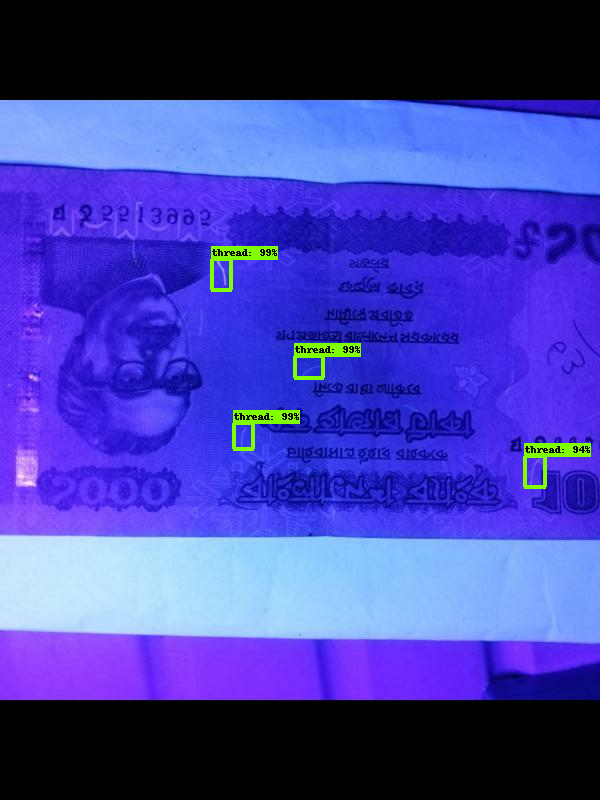

# Currency-s_small_thread_detection_tf
Trying to detect the small thread of bank notes which is visible under UV light.
# Dataset 
For Dataset, We create a custom dataset. Then apply augmentation techniques.

# Result

# Detection Results

